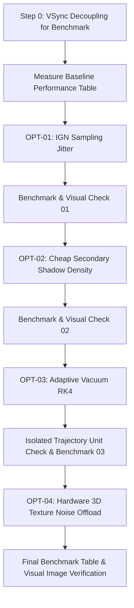

# Performance Optimization Plan (OPT-01 to OPT-04) — Amended

Incremental optimization of the Schwarzschild black hole raymarching renderer to achieve higher, smoother frame rates across all presets while strictly preserving physical fidelity (frozen physics model, crisp photon ring, intact secondary gravitational lensing arch, and silky volumetric smoke filaments).

## User Review & Technical Amendments Incorporated

> [!IMPORTANT]
> **1. Physical Camera Origin Preserved (OPT-01)**: The camera origin $\mathbf{p}_{\text{cam}}$ remains strictly unchanged. Jitter is applied strictly to the integration parameter / volumetric sampling offset ($\lambda + \delta\lambda$) to break up spatial banding, not by displacing the camera origin. Step reductions are evaluated strictly empirically.
>
> **2. Defensible Tolerance Criteria (OPT-03)**: Step controller changes will not be claimed as "mathematically exact". Instead, adaptive RK4 stepping must satisfy strict numerical and visual bounds:
> - Shadow boundary: $< 0.5$ pixel deviation
> - Critical photon ring: $< 1.0$ pixel deviation
> - Secondary lensed arch: visually indistinguishable
>
> **3. Accurate Hardware Characterization (OPT-04)**: Shift expensive procedural noise generation from ALU-heavy trigonometric/permutation hashes to hardware-filtered 3D texture lookups (leveraging cache and texture hardware without overclaiming theoretical cycle counts).
>
> **4. Isolated Trajectory Unit Benchmark (OPT-03)**: An isolated trajectory verification check will compare baseline vs adaptive trajectories for 4 representative rays (Center capture, Near photon sphere, Through-disk, Far escaping) checking final capture/escape, disk intersection, and asymptotic deflection vector.
>
> **5. Escape Radius Untouched**: Weak-field deflection at $b \approx 50 R_s$ is $\approx 2 R_s / b \approx 0.04 \text{ rad} \approx 2.3^\circ$; the escape radius remains at $110 R_s$.

---

## Execution Workflow

---

## Detailed Implementation Steps

### Step 0: Profiling Setup (VSync Decoupling for Benchmarks)
- **Goal**: Measure raw GPU frame time (ms) and uncapped FPS during benchmarking.
- **Changes**:
  - Add `setSwapInterval(int interval)` to [`Window.java`](file:///home/nexus/Documents/Projects/Java%20Microproject/src/main/java/cosmic/app/Window.java).
  - In [`BlackHoleApp.java`](file:///home/nexus/Documents/Projects/Java%20Microproject/src/main/java/cosmic/app/BlackHoleApp.java), call `window.setSwapInterval(0)` during `--capture-benchmark` (and restore `1` for normal gameplay).
  - Measure uncapped **Baseline** on `LOW`, `MEDIUM`, and `HIGH`.

---

### OPT-01: Interleaved Gradient Noise (IGN) Volumetric Sampling Jitter
- **Goal**: Break up structured grid alignment and eliminate volumetric banding.
- **Changes**:
  - Implement Jorge Jimenez's IGN in [`noise.glsl`](file:///home/nexus/Documents/Projects/Java%20Microproject/src/main/resources/shaders/include/noise.glsl):
    $$\text{IGN}(x, y) = \text{fract}\left(52.9829189 \times \text{fract}\left(0.06711056 \cdot x + 0.00583715 \cdot y\right)\right)$$
  - In [`blackhole.frag`](file:///home/nexus/Documents/Projects/Java%20Microproject/src/main/resources/shaders/blackhole.frag), apply jitter to the volumetric sampling parameter along the step rather than offsetting the physical camera origin:
    $$\Delta s_{\text{jitter}} = \Delta s \cdot (0.5 + 0.5 \cdot \text{IGN}(\mathbf{x}_{\text{screen}}))$$
- **Verification**: Measure GPU ms delta; inspect disk image for absence of wood-grain banding.

---

### OPT-02: Cheap Secondary Shadow Density (`sampleBulkAccretionDensity`)
- **Goal**: Eliminate redundant multi-octave domain warping in the secondary inner-illumination shadow march.
- **Changes**:
  - Add `sampleBulkAccretionDensity(vec3 p)` in [`accretion.glsl`](file:///home/nexus/Documents/Projects/Java%20Microproject/src/main/resources/shaders/include/accretion.glsl):
    - Vertical Gaussian stratification $\times$ radial ISCO/outer envelope falloff.
    - Samples macro density from hardware 3D texture (`u_NoiseTexture3D.r`).
    - Bypasses software trigonometric hashes (`gradientNoise3D`) and billow noise.
  - In [`radiative_transfer.glsl`](file:///home/nexus/Documents/Projects/Java%20Microproject/src/main/resources/shaders/include/radiative_transfer.glsl), update `computeInnerDiskTransmittance()` to call `sampleBulkAccretionDensity`.
- **Verification**: Measure GPU ms delta; verify that soft shadow penumbra on the disk is visually preserved.

---

### OPT-03: Adaptive Vacuum RK4 Stepping & Trajectory Verification
- **Goal**: Safely scale geodesic step size through empty, weakly-curved vacuum while strictly bounding numerical error.
- **Changes**:
  - In [`blackhole.frag`](file:///home/nexus/Documents/Projects/Java%20Microproject/src/main/resources/shaders/blackhole.frag):
    - Near photon sphere ($r < 3.5 R_s$): strictly finest $\Delta\lambda$.
    - Inside accretion disk envelope: fine $\Delta\lambda$ for optical depth integration.
    - Far vacuum outside envelope: scale $\Delta\lambda$ with local curvature distance $r/R_s$ up to a bounded maximum.
  - Add a dedicated unit test / diagnostic check in [`BlackHolePhysicsTest.java`](file:///home/nexus/Documents/Projects/Java%20Microproject/src/test/java/cosmic/BlackHolePhysicsTest.java) comparing 4 canonical trajectories:
    1. Center plunging ray ($b = 0$)
    2. Critical photon sphere ray ($b \approx 2.6 R_s$)
    3. Through-disk ray ($b \approx 8 R_s$)
    4. Far escaping ray ($b \approx 25 R_s$)
    Ensuring capture/escape states match and deflection angle deviates by $< 0.1\%$.
- **Verification**: Run trajectory test; measure GPU ms delta; verify secondary arch under the black hole remains intact.

---

### OPT-04: Hardware 3D Base Noise Texture Optimization
- **Goal**: Offload procedural noise calculations from shader math ALUs to GPU hardware texture filtering.
- **Changes**:
  - Leverage the pre-generated RGBA channels in [`Texture3D.java`](file:///home/nexus/Documents/Projects/Java%20Microproject/src/main/java/cosmic/graphics/Texture3D.java):
    - R: Base FBM
    - G: Turbulent shearing
    - B: Filamentary detail
    - A: Clumping / hotspots
  - In [`accretion.glsl`](file:///home/nexus/Documents/Projects/Java%20Microproject/src/main/resources/shaders/include/accretion.glsl), sample texture channels for base domain warping, replacing software trigonometric hashes with hardware trilinear texture reads.
- **Verification**: Measure GPU ms delta; confirm visual preservation of plasma swirls and filaments.

---

## Incremental Benchmark Tracking

| Stage | LOW (96) ms / FPS | MEDIUM (160) ms / FPS | HIGH (240) ms / FPS | Visual / Numerical Verification |
| :--- | :---: | :---: | :---: | :--- |
| **0. Baseline (Uncapped)** | TBD | TBD | TBD | Reference captured |
| **1. + OPT-01 (IGN Jitter)** | TBD | TBD | TBD | Banding eliminated |
| **2. + OPT-02 (Cheap Shadows)** | TBD | TBD | TBD | Soft penumbra preserved |
| **3. + OPT-03 (Adaptive Vacuum)**| TBD | TBD | TBD | 4 Trajectory check passed |
| **4. + OPT-04 (Hardware 3D Noise)**| TBD | TBD | TBD | Plasma filaments preserved |
